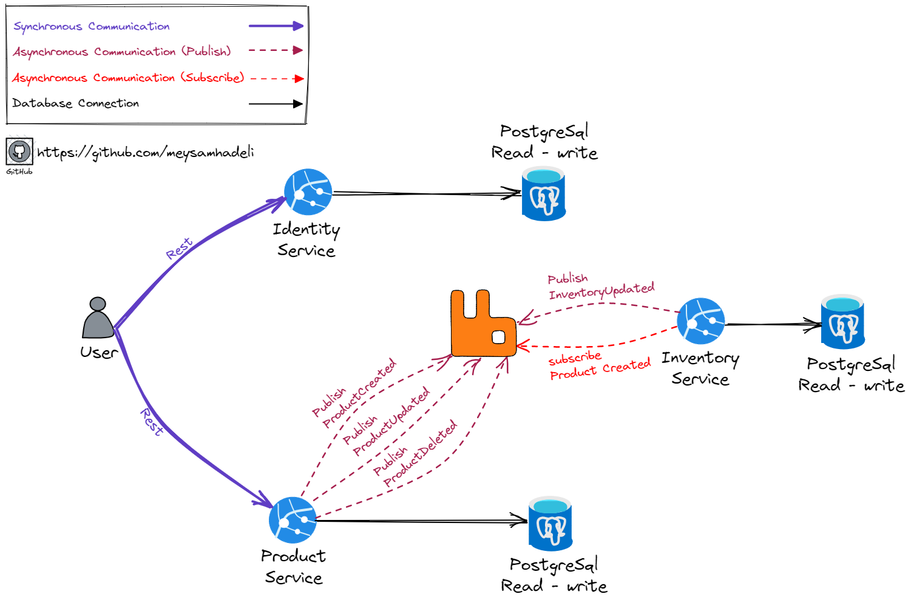
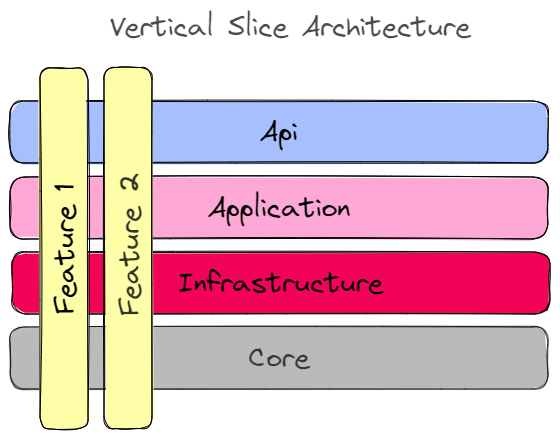

# 📍 Shop Golang Microservices

> **A practical and imaginary microservices for implementing an infrastructure for up and running distributed system with the latest technology and architecture like Vertical Slice Architecture, Event Driven Architecture, CQRS, Postgres, RabbitMq in Golang.** 🚀

> 💡 **This project is not business-oriented and most of my focus was in the thechnical part for implement a distributed system with a sample project. In this project I implemented some concept in microservices like Messaging, Tracing, Event Driven Architecture, Vertical Slice Architecture, CQRS.**

<a href="https://gitpod.io/#https://github.com/meysamhadeli/shop-golang-microservices"></a>


  
## Plan

> 🌀This project is a work in progress, new features will be added over time.🌀

I will try to register future goals and additions in the [Issues](https://github.com/meysamhadeli/shop-golang-microservices/issues) section of this repository.


## The Domain And Bounded Context - Service Boundary



## Structure of Project

In this project I used [vertical slice architecture](https://jimmybogard.com/vertical-slice-architecture/) and [feature folder structure](http://www.kamilgrzybek.com/design/feature-folders/) to structure my files.

I used [RabbitMQ](https://github.com/rabbitmq) as my MessageBroker for async communication between microservices using the eventual consistency mechanism. 

Microservices are `event based` which means they can publish and/or subscribe to any events occurring in the setup. By using this approach for communicating between services, each microservice does not need to know about the other services or handle errors occurred in other microservices.

I treat each request as a distinct use case or slice, encapsulating and grouping all concerns from front-end to back.
When adding or changing a feature in an application in n-tire architecture, we are typically touching many "layers" in an application. We are changing the user interface, adding fields to models, modifying validation, and so on. Instead of coupling across a layer, we couple vertically along a slice. We `minimize coupling` `between slices`, and `maximize coupling` `in a slice`.

With this approach, each of our vertical slices can decide for itself how to best fulfill the request. New features only add code, we're not changing shared code and worrying about side effects.

<div align="center">
  
</div>

Instead of grouping related action methods in one endpoint, I used the [REPR pattern](https://deviq.com/design-patterns/repr-design-pattern). Each action gets its own small endpoint, and for communication between our endpoint and handlers, I use [Go-MediatR](https://github.com/mehdihadeli/Go-MediatR) for decouple our endpoint to handlers directly, and it gives use some pipeline behavior for logging, caching, validation and... easily.

The use of the [mediator pattern](https://golangbyexample.com/mediator-design-pattern-golang/) in my endpoints creates clean and thin endpoint. By separating action logic into individual handlers we support the [Single Responsibility Principle](https://en.wikipedia.org/wiki/Single_responsibility_principle) and [Don't Repeat Yourself principles](https://en.wikipedia.org/wiki/Don%27t_repeat_yourself), this is because traditional controllers tend to become bloated with large action methods and several injected `Services` only being used by a few methods.

I used CQRS to decompose my features into small parts that makes our application:

- Maximize performance, scalability and simplicity.
- Easy to maintain and add features to. Changes only affect one command or query, avoiding breaking changes or creating side effects.
- It gives us better separation of concerns and cross-cutting concern (with help of mediatr behavior pipelines), instead of bloated service classes doing many things.

Using the CQRS pattern, we cut each business functionality into vertical slices, for each of these slices we group classes (see [technical folders structure](http://www.kamilgrzybek.com/design/feature-folders)) specific to that feature together (command, handlers, infrastructure, repository, controllers, etc). In our CQRS pattern each command/query handler is a separate slice. This is where you can reduce coupling between layers. Each handler can be a separated code unit, even copy/pasted. Thanks to that, we can tune down the specific method to not follow general conventions (e.g. use custom postgresql query or even different storage). In a traditional layered architecture, when we change the core generic mechanism in one layer, it can impact all methods.


## How to Run

> ### Docker-Compose

Use the command below to run our `infrastructure` with `docker` using the [infrastructure.yaml](./deployments/docker-compose/infrastructure.yaml) file at the `root` of the app:

```bash
docker-compose -f ./deployments/docker-compose/infrastructure.yaml up -d
```
##### Todo
I will add `docker-compsoe` for up and running whole app here in the next...


> ### Build
To `build` each microservice, run this command in the root directory of each microservice where the `go.mod` file is located:

```bash
go build -v ./...
```

> ### Run
To `run` each microservice, run this command in the root of the microservice where `go.mod` is located:

```bash
go run -v ./...
```

> ### Test
To `test` each microservice, run this command in the root directory of the microservice where the `go.mod` file is located:

```bash
go test -v ./...
```

> ### Documentation Apis


Each microservice has a `Swagger OpenAPI`. Browse to `/swagger/index.html` for a list of endpoints.

> Note: For generate Swagger OpenAPI, we need to install `swag cli` with this command below:
```bash
go install github.com/swaggo/swag/cmd/swag@v1.8.3
```

As part of API testing, I created the [shop.rest](./shop.rest) file which can be run with the [REST Client](https://github.com/Huachao/vscode-restclient) `VSCode plugin`.


